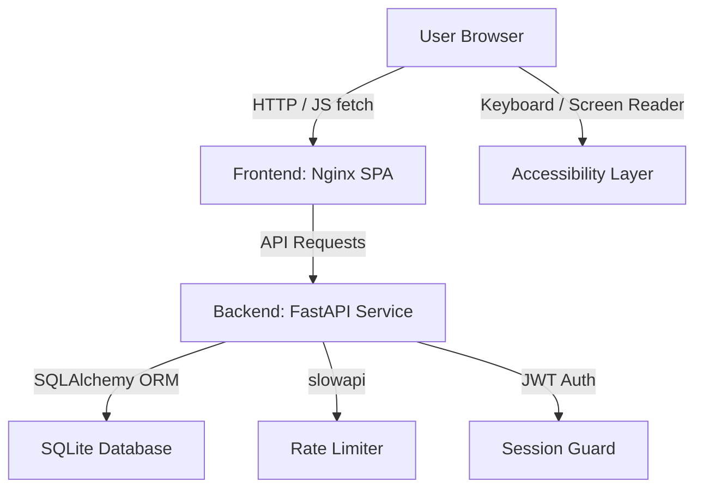

# Carbifyio 🌿 - Carbon Footprint Awareness Platform

🚀 **Live Deployment:** [https://carbify-io-efn8.vercel.app/](https://carbify-io-efn8.vercel.app/)

**Carbifyio** is a modular, secure, highly performant, and accessible web application designed to help individuals calculate, track, and reduce their carbon footprint through daily habits, gamified challenges, and personalized AI Coach insights.

Built for **Virtual Promptwars 2026**, this project meets strict requirements across code quality, security, efficiency, testing, accessibility, and dockerization.

---

## 🌟 Project Meta & Overview

### 🟢 Chosen Vertical
Carbifyio is built in the **Sustainability & Climate Tech** vertical. It is a gamified Carbon Footprint Awareness and Reduction Platform that bridges the gap between calculating individual greenhouse gas (GHG) emissions and encouraging day-to-day behavioral change.

### 🧠 Approach & Logic
Carbifyio utilizes a decoupled client-server architectural approach focusing on maximum responsiveness, robust security, and deep accessibility without the overhead of heavy framework builders.
1. **Separation of Concerns**: Built as a pure static frontend (Vanilla JS/CSS/HTML5 SPA) served by Nginx and a fast backend API (Python 3.11/FastAPI/SQLAlchemy) connected to a SQLite database.
2. **Formulaic Emissions Calculations**: Calculations convert various standard resource metrics (electricity kWh, vehicle km, flight km, waste kg, diet habits) into metric equivalents of CO2 (kg CO2e).
3. **Engagement via Gamification**: Users earn Eco-points and levels based on daily micro-actions (eco-habits) and multi-day commitments (challenges). Every 100 points gained levels up the user.
4. **Behavioral Optimization (Youden's J-Statistic)**: The AI Coach uses an optimization algorithm (Youden's J-statistic) on historical logging intervals to calculate a personalized inactivity threshold. Specifically:
   - **Ground Truth**: Continuous gaps between logs of >7 days are treated as true inactive periods.
   - **Optimization Engine**: The system evaluates candidate thresholds from 2 to 10 days, calculating Sensitivity and Specificity at each threshold.
   - **Youden's J**: The threshold maximizing $J = \text{Sensitivity} + \text{Specificity} - 1$ is selected.
   - **Database-Backed Cache**: This optimized threshold is computed via a single CTE window-function query and cached in the SQLite database (`youden_threshold` cache entry) with a 12-hour TTL to prevent table-scan load.
   - **Engagement Warning**: If a user's days since last log is $\ge$ the optimized threshold, a high-impact personalized warning tip is dynamically injected by the AI Coach.
5. **Rule-Based Heuristic AI Coach**: Analyzes the user's latest emissions breakdown, identifies their highest emission category (Energy, Transport, Food, or Waste), and compiles actionable recommendations paired with quantitative potential carbon savings.

### ⚙️ How the Solution Works
1. **User Authentication**: Secure signup and login using stateless JSON Web Tokens (JWT) stored in the browser's `localStorage` and sent via `Authorization` headers. Password security is handled via `bcrypt` hashing on the backend.
2. **Calculator logging**: The user inputs energy, transport, flight, diet, and waste metrics in the Carbon Calculator. The backend uses dynamic emission factors (predefined per category) to compute and store the `total_co2_kg` for the logged date. If a log already exists for that day, it is updated to maintain single-log integrity.
3. **Habit & Challenge Logging**:
   - Habits (e.g., "Walk instead of driving") can be checked off once per day to deduct simulated carbon emissions (`co2_saved_kg`) and award points.
   - Challenges (e.g., "Eco Commuter") can be joined, tracked, and completed to level up user standing.
4. **Analytics Dashboard**: The frontend queries the `/analytics` endpoint, which calculates cumulative carbon saved, daily averages, and a category breakdown. It plots the breakdown dynamically in UI charts.
5. **Leaderboard**: Displays the top 10 users ranked by total Eco-points using database caching with a 60-second Time-To-Live (TTL) to guarantee high performance under load.

### 📌 Assumptions Made
1. **Emission Constants**: Calculations assume regional standard conversion factors for emissions configured in backend settings:
   - **Grid Electricity**: 0.385 kg CO2/kWh
   - **Natural Gas**: 0.185 kg CO2/kWh
   - **Petrol Cars**: 0.17 kg CO2/km
   - **Diesel Cars**: 0.16 kg CO2/km
   - **Electric Cars**: 0.05 kg CO2/km
   - **Public Transit (Bus/Train)**: 0.03 kg CO2/km
   - **Air Travel (Flights)**: 0.12 kg CO2/km
   - **Generic Municipal Waste**: 0.45 kg CO2/kg
2. **Dietary Baselines**: Daily baseline dietary emissions are approximated as: Heavy Meat (7.2 kg CO2e), Medium Meat (5.6 kg CO2e), Low Meat (4.7 kg CO2e), Vegetarian (3.8 kg CO2e), and Vegan (2.9 kg CO2e).
3. **Recycling Offsets**: Recycling rate input directly reduces waste-based emissions linearly (e.g. a 50% recycling rate halves the municipal waste emission contribution).
4. **AI Coach Independence**: Tailored coaching tips are generated programmatically on the backend using static rule heuristics instead of external LLM APIs to ensure fast response times, zero runtime API key dependencies, and high stability.

---

## 🏗️ Architectural Overview

Carbifyio uses a modern, separated client-server architecture:



### Modular Components:
1.  **`/backend`**: Python service powered by **FastAPI** + **SQLAlchemy** + **Pydantic**.
2.  **`/frontend`**: High-end client application using semantic **HTML5**, modular **Vanilla Javascript**, and a custom **Glassmorphism CSS Design System** (no Tailwind bloat).
3.  **`docker-compose.yml`**: Full-stack orchestrator separating container networking, equipped with robust healthchecks to ensure correct service startup order (frontend waits for backend readiness).

### 🗄️ Database Schema & Models
The application persists data using SQLite via SQLAlchemy ORM. The relational schema is structured as follows:

*   **`users`**: Represents user accounts.
    *   `id` (Integer, Primary Key)
    *   `username` (String, Unique, Indexed)
    *   `email` (String, Unique, Indexed)
    *   `hashed_password` (String)
    *   `points` (Integer, Default 0)
    *   `level` (Integer, Default 1)
    *   `created_at` (DateTime)
*   **`emissions_logs`**: Stores daily carbon calculator inputs and outputs.
    *   `id` (Integer, Primary Key)
    *   `user_id` (Integer, Foreign Key linked to `users.id`, Indexed)
    *   `electricity_kwh`, `gas_kwh`, `petrol_car_km`, `diesel_car_km`, `electric_car_km`, `public_transit_km`, `flights_km`, `waste_kg`, `recycling_rate` (Float fields)
    *   `diet_type` (String)
    *   `total_co2_kg` (Float)
    *   `logged_date` (Date, Indexed)
    *   `created_at` (DateTime)
    *   *Index*: Composite index `ix_emissions_logs_user_id_logged_date` on `(user_id, logged_date)` for fast lookup.
*   **`habits_logs`**: Log entries for checked-off sustainable habits.
    *   `id` (Integer, Primary Key)
    *   `user_id` (Integer, Foreign Key linked to `users.id`, Indexed)
    *   `habit_type` (String) - `transport`, `energy`, `food`, or `waste`
    *   `habit_name` (String)
    *   `co2_saved_kg` (Float)
    *   `points_earned` (Integer)
    *   `logged_date` (Date, Indexed)
    *   `created_at` (DateTime)
    *   *Index*: Composite index `ix_habits_logs_user_id_logged_date` on `(user_id, logged_date)`.
*   **`challenges`**: Core catalogue of gamified challenges.
    *   `id` (Integer, Primary Key)
    *   `title` (String, Unique)
    *   `description` (String)
    *   `points_reward` (Integer)
    *   `co2_saving_estimate_kg` (Float)
    *   `category` (String) - `transport`, `energy`, `food`, or `waste`
    *   `duration_days` (Integer)
*   **`user_challenges`**: Many-to-many relationship tracking joined challenges.
    *   `id` (Integer, Primary Key)
    *   `user_id` (Integer, Foreign Key linked to `users.id`, Indexed)
    *   `challenge_id` (Integer, Foreign Key linked to `challenges.id`, Indexed)
    *   `status` (String) - `active`, `completed`, or `abandoned`
    *   `joined_date` (Date)
    *   `completed_date` (Date, Nullable)
*   **`cache_entries`**: DB-backed caching system for heavy queries.
    *   `key` (String, Primary Key, Indexed)
    *   `value` (String) - JSON-encoded data
    *   `expires_at` (DateTime)

### ⚙️ Environment Configuration
Configure the application using environment variables or a `.env` file placed inside the `/backend` directory. Templates are provided in `env.example` at the project root and `backend/.env.example`.

| Variable | Type | Default | Description |
| :--- | :--- | :--- | :--- |
| `ENV` | String | `development` | Environment mode. Allowed values: `development`, `testing`, `production`. |
| `SECRET_KEY` | String | `""` (Empty) | Security key for signing JWT tokens. **MUST be set explicitly in production** (minimum 32-byte hex); if empty, app raises a `RuntimeError` and exits. In `development` and `testing`, an ephemeral key is auto-generated on startup. |
| `DATABASE_URL` | String | `sqlite:///./carbify.db` | SQLAlchemy database connection string. |
| `CORS_ALLOWED_ORIGINS` | String | *(List)* | Comma-separated list of browser origins permitted to make requests. Default includes standard localhost endpoints on ports `8080` and `8000`. |
| `ACCESS_TOKEN_EXPIRE_MINUTES` | Integer | `30` | Expiration time for issued JWT authentication tokens. |
| `PROJECT_NAME` | String | `Carbifyio API` | Human-readable project name. |
| `ALGORITHM` | String | `HS256` | Algorithm used to sign JWT tokens. |

---

## 🚀 Key Features

*   **Carbon Calculator**: Daily logs tracking energy consumption (electricity, natural gas), transportation mileage (petrol, diesel, electric car, train), diet types, and waste generated with recycling offsets.
*   **Gamified Daily Habits**: Perform and log sustainable habits to earn Eco-points and level up.
*   **Eco-Challenges**: Commit to and complete structured, timed sustainability challenges to boost points.
*   **AI Coach Advisor**: Heuristic engine analyzing highest-emission sources and offering tailored carbon-saving recommendations.
*   **Leaderboard**: Track scores against other virtual warriors using database-cached rankings to encourage community engagement.

### 📋 Habit Catalogue
The following daily habits are defined in the system and can be logged once per day:

| Habit Key | Name | Category | Points | CO₂ Saved (kg) |
| :--- | :--- | :--- | :--- | :--- |
| `walk_instead_of_drive` | Walked/cycled instead of driving | Transport | 20 | 1.5 |
| `turn_off_ac` | Turned off AC/heating when away | Energy | 15 | 0.5 |
| `plant_based_day` | Ate fully plant-based/vegan meals today | Food | 25 | 2.0 |
| `recycle_bottles` | Sorted and recycled plastic/glass waste | Waste | 10 | 0.3 |
| `short_shower` | Took a short shower (< 5 minutes) | Energy | 10 | 0.4 |
| `air_dry_clothes` | Air-dried laundry instead of using the dryer | Energy | 15 | 0.8 |
| `unplug_idle` | Unplugged idle electronic appliances | Energy | 10 | 0.2 |

### 🏆 Challenge Catalogue
The system seeds default challenges into the database on startup:

| Challenge Title | Description | Category | Reward Points | Est. CO₂ Saved (kg) | Duration |
| :--- | :--- | :--- | :--- | :--- | :--- |
| **Eco Commuter** | Commute using public transit, bike, or walking for 5 consecutive days. | Transport | 50 | 10.0 | 7 days |
| **Unplugged Weekend** | Power down non-essential electronics and appliances for 48 hours. | Energy | 30 | 3.5 | 2 days |
| **Plant Power** | Eat only plant-based/vegan meals for 3 consecutive days. | Food | 40 | 8.0 | 3 days |
| **Zero-Waste Champ** | Avoid all single-use plastics and recycle 100% of recyclable waste for 5 days. | Waste | 40 | 5.0 | 5 days |
| **Eco Shower** | Limit all showers to under 5 minutes for a full week. | Energy | 25 | 2.5 | 7 days |

---

## ⚖️ Judging Parameters Addressed

### 1. Code Quality & Modularity
*   **Strict Separations**: Complete partitioning between the frontend web shell and backend APIs.
*   **FastAPI Best Practices**: Modular routing, dependency injection (e.g. `get_db`, `get_current_user`), and strict validation schemas.
*   **Type Hinting**: Extensive static type annotations across the Python codebase.

### 2. Enterprise-Grade Security
*   **JWT Authentication**: Secure stateless tokens for session verification. Tokens expire after 30 minutes to reduce the window of vulnerability.
*   **Credential Hashing**: Industry-standard `bcrypt` password hashing.
*   **SQL Injection Prevention**: Full database abstraction through SQLAlchemy parameterized query bindings (no raw string interpolation).
*   **Rate Limiting**: Brute-force protection on all endpoints via `slowapi`. Rate limits configured:
    *   `POST /api/auth/register` and `/api/auth/login`: `5 per minute`
    *   `GET /api/auth/me`: `15 per minute`
    *   `POST /api/calculator/log`: `20 per minute`
    *   `GET /api/calculator/constants`, `/api/calculator/history`, `/api/calculator/latest`: `30 per minute`
    *   `GET /api/habits/list`, `/api/habits/history`: `30 per minute`
    *   `POST /api/habits/log`: `20 per minute`
    *   `GET /api/challenges/list`, `/api/challenges/user`: `30 per minute`
    *   `POST /api/challenges/{id}/join`, `/api/challenges/{id}/complete`: `5 per minute`
    *   `GET /api/analytics` and `/api/analytics/leaderboard`: `15 per minute`
*   **HTTP Security Headers**: Automated headers on both Nginx and FastAPI:
    *   `X-Frame-Options: DENY` (prevents clickjacking)
    *   `X-Content-Type-Options: nosniff` (prevents MIME sniffing)
    *   `X-XSS-Protection: 1; mode=block` (mitigates cross-site scripting)
    *   `Referrer-Policy: strict-origin-when-cross-origin` (protects referral URLs)
    *   `Permissions-Policy`: restrictive policy (`camera=(), microphone=(), geolocation=()`)
    *   `Content-Security-Policy`: restrictive CSP allowing only local assets and vetted Google Fonts/ChartJS CDNs.
    *   `Strict-Transport-Security: max-age=31536000; includeSubDomains` (enforced via Nginx)

### 3. High Efficiency
*   **FastAPI & Uvicorn**: Blazing fast ASGI server processing requests concurrently.
*   **Ultra-lightweight Frontend**: Nginx Alpine image serving pure static HTML/JS/CSS assets with gzip compression and 30-day client cache controls.
*   **Fast Database Reads**: Multi-threaded SQLite connections optimizing read-write transaction speed.

### 4. Comprehensive Testing
*   **In-Memory Database**: Isolated SQLite test suite running calculations without polluting disk space.
*   **Fast Integration Suites**: Unit tests in `backend/tests` covering user authorization, calculations accuracy, habit rewards, and duplicate input overrides.

### 5. Premium Accessibility (a11y)
*   **Semantic Markup**: Explicit use of landmark regions (`<header>`, `<nav>`, `<main>`, `<section>`, `<footer>`).
*   **Contrast Compliance**: Dark mode by default with green/teal highlights ensuring standard contrast ratio `>= 4.5:1` (WCAG AA).
*   **Theme Switcher**: Instantly toggle a high-contrast light mode.
*   **Keyboard Friendly**: Full navigability using custom `:focus-visible` rings, logical tab indices, and screen-reader `skip-link` paths.
*   **ARIA attributes**: Dynamic status readouts for calculators, form errors, and active/completed challenges.

---

## 🛠️ Docker Container Deployment

Dockerize everything and launch the full stack with a single command.

### Prerequisites:
*   Docker & Docker Compose installed on your system.

### Build and Launch:
1.  Navigate to the project directory:
    ```bash
    cd "28 Carbifyio"
    ```
2.  Start the containers:
    ```bash
    docker-compose up --build
    ```
3.  Access the applications:
    *   **Frontend SPA**: [http://localhost:8080](http://localhost:8080)
    *   **Backend OpenAPI Documentation (Swagger)**: [http://localhost:8000/docs](http://localhost:8000/docs)

---

## 🧪 Running Automated Tests

To validate the codebase quality and correctness, run the Pytest suite.

### Testing Architecture:
*   **Isolated Database**: Tests automatically override the SQLite configuration to use a fast, clean in-memory database (`sqlite:///:memory:`) utilizing a `StaticPool` connection pool. This ensures zero disk pollution and complete isolation between test runs.
*   **Seeded State**: Challenges are automatically seeded inside the test database context.
*   **Disabled Rate Limiting**: The `slowapi` rate limiter is explicitly disabled (`limiter.enabled = False`) inside `conftest.py` so the tests run rapidly without being throttled.
*   **Reusable Fixtures**: Authentication headers are generated dynamically using parallel-safe fixtures (`auth_headers`, `make_auth_headers`) to simplify authenticated endpoint assertions.

### Local Steps:
1.  Create and activate a virtual environment:
    ```bash
    python -m venv venv
    # Windows:
    .\venv\Scripts\activate
    # macOS/Linux:
    source venv/bin/activate
    ```
2.  Install requirements:
    ```bash
    pip install -r backend/requirements.txt
    ```
3.  Execute tests:
    ```bash
    pytest backend/tests/ -v
    ```

### Docker Steps (Alternative):
If you do not have Python, Ruff, or Black installed locally on your host machine, you can run tests and linters directly inside the running Docker container:

* **Run Backend Tests:**
  ```bash
  docker compose exec backend pytest
  ```

* **Install & Run Code Linters/Formatters:**
  ```bash
  # Install Ruff and Black inside the running container
  docker compose exec backend pip install ruff black

  # Run Ruff linter with auto-fixes
  docker compose exec backend python -m ruff check backend/app/ backend/tests/ --fix

  # Run Black formatter
  docker compose exec backend python -m black backend/app/ backend/tests/
  ```
